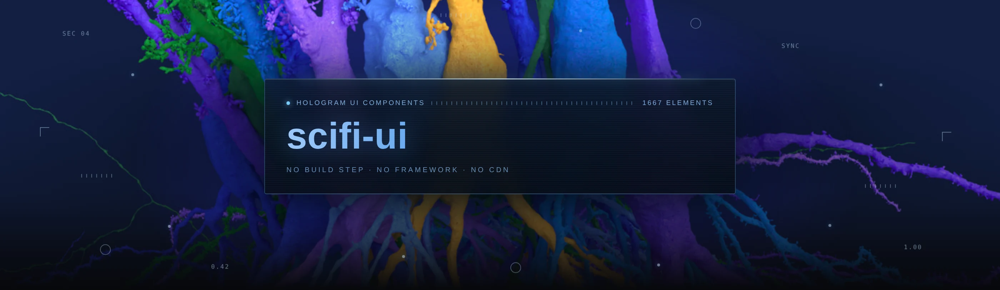
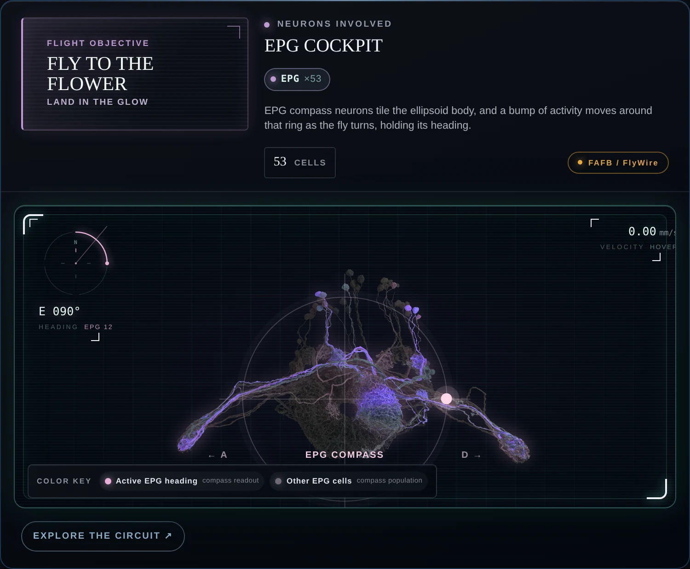
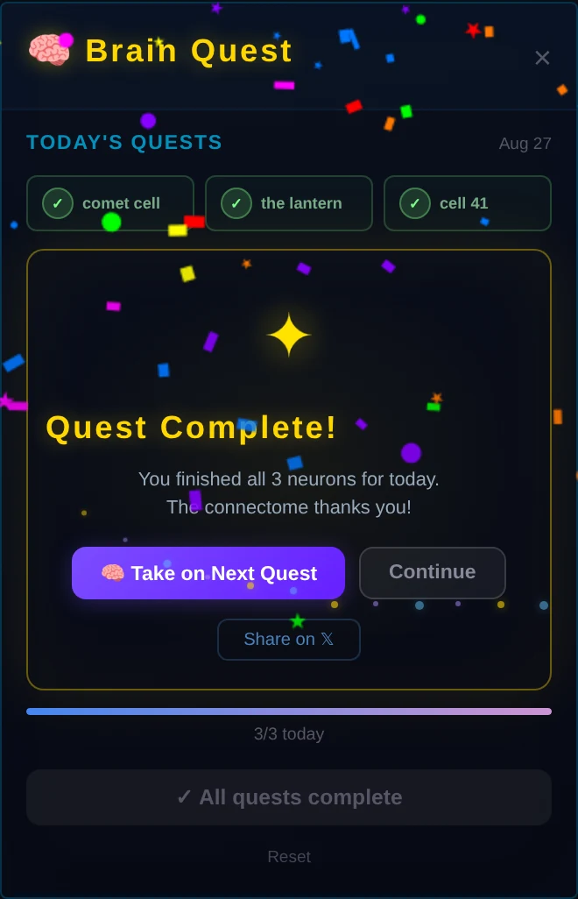
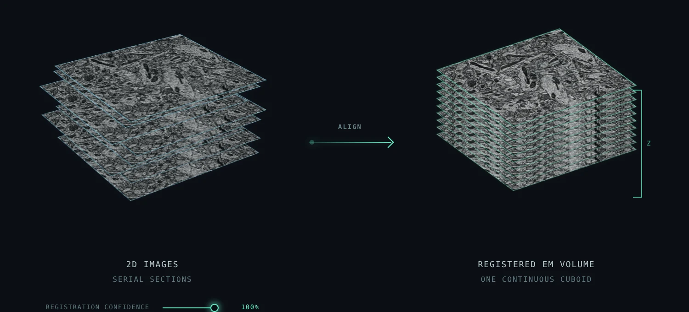
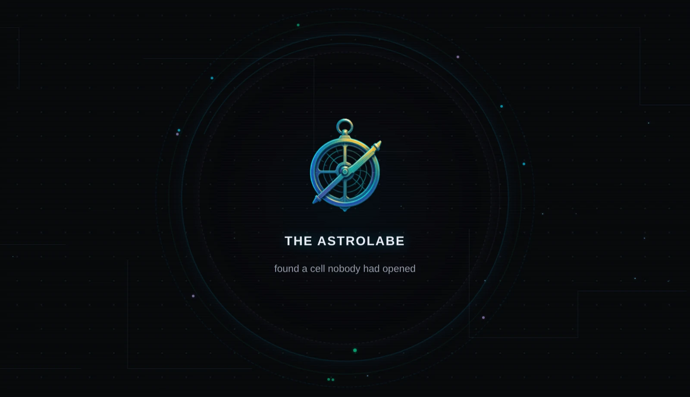
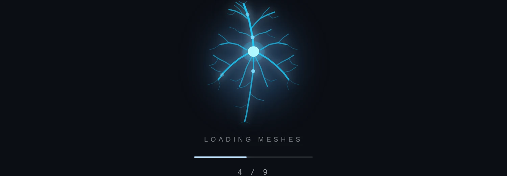
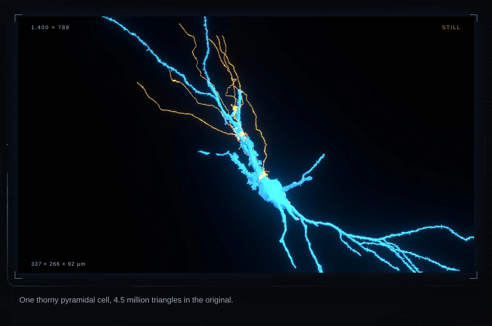
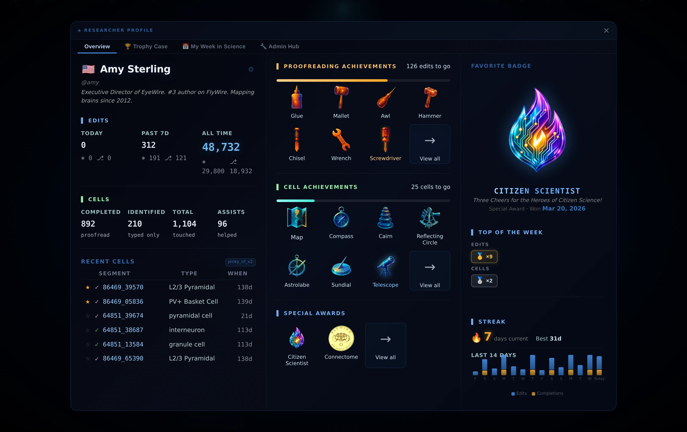

# scifi-ui

**A hologram and scifi inspired UI library for agents.**

### [Live demo](https://amyleesterling.github.io/scifi-ui/)

Every component running, framed around real 3D renders of reconstructed
neurons. Hover anything.

A small, dependency free set of hologram and HUD parts for a dark page: a
draggable step rail, a vertical section rail for the page itself, a readout
panel, an underline that draws itself, a panel that boots up, a scan sweep, an
image card with an edge trace, a modal dialog surface, a loading state that
draws a cell, and a particle trace for media with brackets, readouts and a play
affordance.

No build step, no framework, no CDN. Two files for everything above:
`hologram.css` and `hologram.js`, plus `hologram-tap.js`, which is what makes
every hover treatment reachable on a screen with no pointer to hover with. That
third file belongs on any page using any part of this library, including the
components below.

A second set lives in [`components/`](components/), one file per part, with its
own [demo page](https://amyleesterling.github.io/scifi-ui/components/): a
tutorial callout, an achievement toast, a confetti burst, a tinted lift card, an
icon rail (`.holoiconrail`, kept clear of the section rail's `.holorail`), a page
finale that fires the confetti once when the reader reaches the bottom and floats
a mascot up on balloons, a shared panel surface (`.holopanel`), a profile card
built on it, the full EyeWire II researcher profile it opens into, a measured
data readout, and a converging swarm (`.holoconverge`) that flocks particles
into whatever element you point it at. They are split one per file so you can take one without taking
the set, and the whole set also runs inline on the main
[demo page](https://amyleesterling.github.io/scifi-ui/).

The panel surface is the one worth a word here. A dark gradient panel with a lit
top edge and a materialise entrance recurred in four upstream places, each with
its own copy; `components/panel-surface.css` is that surface pulled out once, and
the profile panel is the first component built on it rather than a fifth copy. It
wins without `!important`: a library has no host page to fight.

The researcher profile is not a lookalike, it is the EyeWire II
`UserProfilePanel` carried across whole. The component ships in a built bundle
with source maps, so its real compiled CSS was lifted from the map and de-scoped
from its Vue `data-v` hash, the DOM rebuilt from the same class names, the badge
art taken from the game's own `center-art` PNGs and resized into
[`media/badges/`](media/badges), and the numbers filled from the demo profile
the game itself ships (Amy Sterling). The `nge-profile-*` classes are the
originals. It carries the three column overview, the trophy case with the
animated featured badge (spinning rings, orbit dots, a pulsing aura), the badge
detail that swaps into the right column when you click a badge, and the all
special awards modal. A visual component: no account, no request. The only
adaptations are the container, the game mounted it in neuroglancer's overlay and
here a `<dialog>` plays that role, and a phone breakpoint that stacks the three
columns.

The readout (`.holoreadout`) is the one to reach for when you have real numbers
to show: a stat row, the distribution behind those stats, and one line saying
where the numbers came from. Hand `holoReadout()` the data and it derives every
figure, so the panel cannot drift away from what it describes. It is the banner
panel from the [MICrONS cortex page](https://amyleesterling.github.io/microns/),
reporting the 38 proofread cells the render behind it was built from.

```js
holoReadout(el, {
  stats: [{ value: 38, label: "cells" },
          { value: 481, unit: "µm", label: "of cortex" }],
  histogram: { values: [4, 4, 3, 3, 6, 2, 3, 7, 1, 0, 1],
               colour: i => depthColour(400 + i * 50) },
  caption: holoReadout.value(34) + " somata by depth",
  provenance: "CAVE · minnie65_phase3_v1 · mat 1853",
});
```

**Read the top of `data-readout.css` before you write any HUD label anywhere.**
A unit symbol inside `text-transform: uppercase` is corrupted by the browser:
the micro sign becomes a Greek capital Mu, so `481 µm` renders as `481 MM`, a
different character and off by a thousand. That was live on a published page
for weeks, because MM reads as a plausible unit. Units belong in
`.holoreadout-u`, and `holoReadout.value()` puts them there for you.

```html
<link rel="stylesheet" href="hologram.css">

<nav class="holorail" data-holorail="h2"></nav>

<div class="holobar" data-steps="10" data-step="8"></div>

<figure class="holocard">
  
</figure>

<figure>
  <div class="holoframe">
    <canvas class="trace"></canvas>
    
  </div>
  <figcaption>Anything you like.</figcaption>
</figure>

<script src="hologram.js"></script>
<script src="hologram-tap.js"></script>
```

Every component is independent. Take one, delete the rest. Every colour is a
custom property with a concrete fallback, so any single piece works pasted into
a page that has no token system.

Open `index.html` for a working demo.

---

## A look at it

Every shot below is the library running, captured off the demo page. Nothing is
a mockup.

<table>
<tr>
<td width="50%"><br><b>Cockpit HUD</b><br>The neural interface panel from BE THE FLY, with the heading gauge and the real EPG renders relighting under the reticle.</td>
<td width="50%"><br><b>Brain Quest</b><br>Three neurons a day. The third one fires the card, the toast and the confetti together.</td>
</tr>
<tr>
<td><br><b>Registration</b><br>The ALIGN stage of the connectome pipeline. Drag the confidence and the sections converge.</td>
<td><br><b>Trophy orbit</b><br>Five counter rotating rings, twelve orbit dots on two radii, a breathing aura.</td>
</tr>
<tr>
<td><br><b>Loading state</b><br>Every dendrite grows out of the soma, then the axon, and only then do the action potentials travel it.</td>
<td><br><b>Particle trace</b><br>An arc struck from wherever your pointer crossed, and a HUD whose every number is measured, not written.</td>
</tr>
</table>

The researcher profile, carried across whole from EyeWire II:



---

## The one idea worth taking

**Ornament that encodes something true reads as designed. Ornament that encodes
nothing reads as a screensaver.**

Every readout in this system is real. Dimensions, duration and frame count are
read off the media element at runtime, so they cannot drift out of date, and a
figure can carry one measured value via `data-hud`. The step rail reports the
step it is actually on. The loading bar goes indeterminate rather than inventing
a percentage. When the numbers mean something, a viewer feels it even without
reading them.

This is the difference between a sci-fi interface and a costume. If you take one
thing from this repo, take that, not the CSS.

---

## What each piece does

### 1. Step rail (`.holobar`)

```html
<div class="holobar" data-steps="10" data-step="8" aria-label="Tour stage"></div>
```

A counter in tabular caps, a hairline rail, the run so far filled and glowing, a
brighter dot where you are, dimmer ticks after it. The script builds the counter,
the rail, the fill and one button per step, so the markup is one empty div.

Any number of steps. **Drag the rail** and the step follows the pointer. Click a
tick to jump. Focus a tick and use the arrow keys, or Home and End. Steps are
counted from 1, because that is what the counter shows. It reports back three
ways:

```js
bar.addEventListener("holobar:change", e => e.detail.step);  // 1 based
bar.getAttribute("data-step");
bar.holobar.step;            // also settable, plus next() and prev()
```

Only the current tick is in the tab order, and the arrows move the selection
rather than just the focus, because selecting is the whole point of the control.
The hit area is 16px so a finger can find a 3px dot. The fill stops at the dot
you are on rather than one step past it, so it still reads correctly at three
steps as well as at thirty.

**On dragging.** `pointerdown` on the rail or on any tick starts a drag,
`pointermove` updates the step continuously, `pointerup` ends it. The rail calls
`setPointerCapture`, so a drag survives leaving a 2px line, which is most of why
it feels like a control rather than a row of buttons. `touch-action: none` keeps
a drag that starts on the rail from being taken over by the page scroll.

Three details that are not obvious:

The 700ms ease on the fill is dropped for the duration of the drag. It is what
makes a click feel considered, and it is what makes a drag feel like the light is
chasing your hand rather than following it.

Focus moves to the tick you drop on. The roving tabindex has already moved there,
so leaving focus on the tick you grabbed would leave a focused element that is
not the current one, with `tabindex="-1"` on it.

The click a browser fires at the end of a drag has to be ignored, or it snaps the
step back to whichever tick was under the pointer when the button came up. That
guard is a 300ms deadline rather than a boolean, because a drag that ends on the
rail itself produces no tick click at all, and a boolean would still be set when
the next real click arrived.

### 2. Readout panel (`.holo`)

One label, one number, one line of context. The smallest component here and the
one that carries the idea: say something true and the ornament stops being
ornament.

### 3. Underline that draws itself (`.holounder`)

A hairline runs out from under a heading the first time that heading is
actually on screen, and draws again on hover or on a tap. Its resting state is
the finished line, so a page with the script stripped out still shows the
underline instead of nothing.

### 4. Panel that boots up (`.holoboot`)

Add the class to any panel. Two bright heads run the border in opposite
directions and meet, an inner backlight swells and tapers, and the panel resolves
out of a blur. It runs the first time the panel is seen, because a panel that
boots before you scroll to it has booted for nobody, and again on every hover
and every tap.

The replay is why the script removes `is-online` at `animationend` rather than
leaving it on. The `:hover` and `.holo-on` selectors apply the same animation
the class does, and a CSS animation only restarts when its computed name
changes, so a class that never leaves is a replay that can never happen. This
bug shipped: the page promised a boot on every hover and tap and delivered one
boot ever. The class waits for the 1500ms ring sweep to end, not the 900ms
panel entrance, so the sweep is never cut off mid run. The underline's
`is-drawn` comes off the same way.

The two decorative spans are added at runtime and sit at `z-index: -1` inside an
isolated stacking context, which puts them above the panel background and below
its content. That means the host keeps its own border, its own shadow and both of
its pseudo elements, so the class composes onto a panel you already styled.

The border sweep is a pair of conic gradients masked to a 1px ring, with the
angle animated through a registered `@property`. On a browser without
`@property` the angle holds still and the ring simply fades, which is a fine
degradation.

### 5. Scan sweep (`.holosweep`)

A thin line passes across a panel once on hover, focus or a tap. The band is a
background at a fixed height on a full size overlay, so one pass covers the panel
whatever its height.

### 6. Hologram dialog (`.holodialog`)

The EyeWire II sign in modal, reproduced, with the authentication taken out. It
is the densest thing in this repo and every layer earns its place:

**A drifting particle field.** Six `radial-gradient` dots, each a single dot
placed at its own percentage, each tiled at its own `background-size`, so the six
layers beat against one another and never line up into a grid. The whole field
travels 60px by 40px over twenty seconds. The original translates the element,
which opens a gap at the trailing edge once the box is only 460px wide, so here
the `background-position` moves instead.

**A cycling gradient border.** A `linear-gradient` at `background-size: 300%`,
masked down to a 1px ring with `mask-composite: exclude`, cycling through blue,
violet and teal on a six second loop. In the original this is a `::before` at
`inset: -1px` sitting at `z-index: -1`, which a dialog with `overflow: hidden`
clips away, so here it is a real element at `inset: 0`.

**An inner ambient glow**, a radial wash down from the top edge, on `::after` at
200 per cent of the box so the ellipse has room to be an ellipse.

**A materialise entrance**, 0.8s at `cubic-bezier(.16,1,.3,1)`: it arrives at
`scale(1.04)`, `blur(20px)` and `brightness(3)` and settles through a soft
overshoot at 60 per cent. Two counter rotating rings around the glyph, a single
breath on the glyph itself, one pulse on the status row, one band of light across
the button, and one flicker on the data stream line at the foot.

**Exactly two things loop:** the particle drift and the border cycle, because
both are ambient rather than event driven. Everything else runs once per open,
which costs nothing to arrange, because a closed `<dialog>` is `display: none`
and opening it starts every animation over.

It is a real `<dialog>` opened with `showModal`, so focus trapping and Escape
come from the user agent rather than from a script. The script adds initial
focus, focus restored to the opener on close, a backdrop click to dismiss, and a
Tab wrap for the one case where `showModal` is missing.

**There is no authentication in it.** It is a visual component. It carries an
ordinary text input, a button that does nothing, no `<form>` element at all, no
password field, and no wordmark. If you wire it to real credentials, that is on
you, and none of the styling here helps you do it safely.

### 7. Loading state (`.holoload`)


A cell draws itself in while you wait. The basal arbor runs half a cycle behind
the apical one so the two trees do not pulse in lockstep, which is what makes it
read as alive rather than as a spinner.

```html
<div class="holoload" data-loaded="4" data-total="9" role="status"> ... </div>
```

```js
el.holoload.set(loaded, total);   // omit the total and it goes indeterminate
```

With no total it goes indeterminate rather than inventing a number. This is the
only piece in the library that repeats, because a loading state is the one place
a loop is honest.

### 8. Particle trace (canvas)


Three phases on hover, 1.5 s total:

1. **0 to 60%** a short arc of light runs the frame perimeter. Not a full ring:
   a full ring stays lit, which reads as a border rather than an event.
2. **60 to 100%** the beam breaks into particles that decay outward along a
   small three-level branching tree, so the dispersal has structure instead of
   being a puff.

Trails come from fading the previous frame with a `destination-out` fill rather
than clearing, which keeps the canvas transparent over the image underneath.

Starts wherever the pointer crossed the boundary: the code walks 240 points
around the perimeter and takes the nearest. That one detail is most of why it
feels responsive rather than canned.

### 9. HUD annotation (DOM)

Four hairline corner brackets that push outward on hover, plus three readouts.
Two are populated from the media at runtime, the third from `data-hud` on the
figure:

```html
<figure data-hud="165 synapses · 6 fibers"> ... </figure>
```

Shown on hover, on focus, and on a tap. The canvas that runs the trace around it
is still hidden below 700px, because it overhangs its frame by 22px a side and
that is a width problem rather than a pointer problem.

### 10. Play badge

A 74px ring over video, because the native control is small and often lands on
top of whatever is burned into the frame. Hides itself on play, returns on pause,
and native controls stay for scrubbing.

### 11. Source swap

Serves a vertical cut to phones and a widescreen cut to everything else:

```html
<video controls playsinline muted loop preload="metadata"
       poster="vertical.jpg"
       data-wide="wide.mp4" data-wide-poster="wide.jpg">
  <source src="vertical.mp4" type="video/mp4">
</video>
```

Vertical stays the markup default so a phone never begins downloading the wide
file.

### 12. Section rail (`.holorail`)

```html
<nav class="holorail" data-holorail=".wrap > h2"></nav>
```

A hairline down the left gutter marking the sections of the page: a counter, the
run so far filled, a head that travels, and one dot per heading with a label that
appears when you point at it or tab to it. `data-holorail` takes any selector and
defaults to `h2`. The script gives every matched heading an id if it has none,
builds one anchor per heading, and an `IntersectionObserver` keeps the current one
marked.

The active section is worked out from geometry rather than from the observer's
entry list. A heading is a thin element, so it can sit between two crossings with
nothing intersecting at all, and an entry driven implementation goes blank in the
middle of a long section. The observer is the cheap trigger; the handler then asks
each heading where it is and takes the last one that has passed a line 30 per cent
down the viewport. That is exact at any section length, and it costs one bounding
box per heading on a crossing.

The dots are real anchors with real `href`s, so with the script stripped out you
still have a list of links to the sections rather than dead spans, and they land
in the tab order for free. `aria-current="true"` marks the active one and the
counter is an `aria-live` region.

It is `position: fixed`, so it never contributes to the document scroll width.
It hides itself below 1240px, which is the width at which an 860px column stops
leaving a gutter to sit in, and the labels are capped at 132px and clipped,
because past that they would cross into the reading column at 1280px.

Nothing here loops. The position it reports is the position you are at, so a
transition is the honest tool and an animation is not.

### 13. Image card (`.holocard`)

```html
<figure class="holocard">
  
</figure>
```

Near black ink instead of the white tinted glass a panel usually gets, so a
render inside it pops rather than being washed out. Faint scanlines every 3px. A
rim and a backlight that live entirely in the `box-shadow`, so they never lighten
the card body, which is the point of doing it that way rather than with a border
and a background.

**The hover state is shadow only.** Nothing moves, nothing scales, and the image
is never repainted, which is why it stays calm at any size and costs nothing.

The middle shadow layer is `0 0 24px -6px`. The negative spread pulls the glow
back so it hugs the card instead of bleeding off it, and that one number is the
difference between a lit card and a smudge. It is the detail worth copying.

The edge trace is a `conic-gradient` whose bright head covers about a quarter of
the turn, masked to the 1px ring, rotating through a registered `@property`
angle. It is the only loop in the library outside the loading state, and it only
ever runs while you are pointing at the card, which is what makes it a response
rather than a status light. On a browser without `@property` the angle holds still
and the ring simply fades in.

**The accent is a second token**, `--holo-cyan`, at `126 224 255`. It is a teal
leaning cyan and it is deliberately not `--holo-line` at `196 228 255`. The card
reads cooler and harder than the rest of the library, and that difference is the
whole reason it is a separate component. Do not force them to match.

The section rail above uses the same token, for the same reason.

---


### 12. Scout tag mode (`components/scout-tag.*`, `components/scout-trace.js`)

The whole interaction from EyeWire II's Scout tag mode, ported from
`TagModePanel.vue` and `holo_trace.ts` in the eyewire-ii-community branch of
ng-extend. A round trip: the panel began by borrowing this library's
materialize and swarm, grew a light choreography of its own in production,
and that choreography now comes home. `scout-trace.js` is the kit
(`window.holoScout`): the zip, the draw with its clip-reveal callback, the
lap, the particle burst, the burst-build, the burst-coalesce, the scythe
crescent and the flying plus one. `scout-tag.js` is the panel itself: place a
point and a spark answers, submit sends streams that charge the box's
midpoints and light the border from both, collapse races the zip upward
masking the box away to a slim strip, expand draws it back with the beam as
the reveal mask. Three documented deviations: Orbitron named but not bundled,
the product's raster icons not carried, and the demo wrap absolute in its
stage rather than fixed to the viewport.


### 13. The ported ten

One sweep across everything currently shipping, each carried on its source's
own numbers:

- **Shimmer reveal** (`components/shimmer-reveal.js`), the EyeWire II
  welcome: calcium-imaging sparkles bloom while a dark veil dissolves on a
  cosine ease, revealing the scene through the particles. From
  `ConfettiCelebration.vue` sparkle mode.
- **Letter reveal** (`components/letter-reveal.*`), the tutorial title
  landing letter by letter with its two shipped rhythms. From
  `TutorialStep.vue`.
- **Notification scan-in** (`components/notif-scan.css`), the materialize
  entrance with the top edge scanline. From `NotificationFeedPanel.vue`.
- **Recap roll-in** (`components/recap-roll.css`), the report that
  materializes then assembles section by section. From
  `WeeklyRecapPanel.vue` and the profile panel's stagger.
- **Trophy orbit** (`components/trophy-orbit.css`), five counter rotating
  rings, twelve orbit dots and a breathing aura around a floating award.
  From `UserProfilePanel.vue`.
- **Streak flame and toast countdown** (`components/streak-flame.css`,
  `components/toast-countdown.css`), the out of phase flicker and glow,
  and the visible five second dismiss bar with its four type tints.
- **Registration** (`components/alignment-diagram.*`, with
  `components/registration-arrow.css` and `components/block-ping.css`),
  the ALIGN stage of whatisabrain.com's connectome pipeline carried whole:
  raw serial sections sheared apart by the site's own disorder formula, the
  locked-views arrow, and the registered 3D EM volume with a ping at a
  coordinate inside it. The confidence control converges the sections. EM
  texture carried as `media/raw-em.png`.
- **Timeline** (`components/holo-timeline.js`), from human-brain: the
  authored-sequence layer shaped like GSAP's seek and tween core, no
  dependency, reduced motion collapsing to the final state. The export
  becomes `window.holoTimeline`, the one deviation.
- **Brain Quest** (`components/quest-complete.css`), the daily quest board
  from `ProofreadingQueuePanel.vue`, carried with its panel because the
  panel is where the sequence happens: the board on its four second cyan
  breath, three pips flipping to green checks, the progress rail, and on
  the third completion the gold card arriving breathing with twelve
  particles rising in three tints around a pulsing star, the quest toast
  and the rainbow confetti all at once. Its toolbar icon sits in
  `RETIRED_TOOLBAR_ICON_IDS` upstream, so the board is switched off in the
  live app; this is what it does when it runs.
- **Cockpit HUD** (`components/neural-hud.*`), **neuron ignite**
  (`components/neuron-ignite.css`) and **EPG compass**
  (`components/epg-compass.*`), from BE THE FLY: the neural interface panel
  that docks on the right of the play field, carried whole with its lit
  objective, cell identity, drawn-light instruments and colour key; the
  action layer igniting over dim context; and the fly's heading dial whose
  sectors relight as the heading sweeps them. A round trip, this one, since
  that game vendored this library and its HUD already reads these tokens.

## Tokens

Set these on `:root` in `hologram.css`. Space separated RGB so they compose with
`rgb(var(--holo-line) / 0.5)`.

| token | job |
|---|---|
| `--holo-line` | hairlines, brackets, readouts |
| `--holo-beam` | the beam core, and every lit edge |
| `--holo-glow` | its soft outer glow, and panel rims |
| `--holo-warm` | the single warm accent, used once |
| `--holo-panel` | panel fills |
| `--holo-ink` | type, and the unlit half of a rail |
| `--holo-dim` | secondary type |
| `--holo-cyan` | the second accent, for the card and the section rail |
| `--holo-viol` | the violet the dialog rim cycles through |

**Every reference carries a concrete fallback**, as in
`rgb(var(--holo-beam, 178 216 248) / .55)`. Paste any one component into a page
with no tokens defined at all and it still looks right. A bare
`var(--accent)` with nothing behind it computes to an invalid value and the whole
declaration is dropped, which is how focus rings silently disappear.

**One warm accent, used sparingly, against a cool field.** Every good HUD in film
does this. Two accents and it stops reading as an instrument.

`--holo-cyan` is not a second warm accent, it is a second cool one, and it is
scoped: the card and the section rail use it and nothing else does. `--holo-viol`
is narrower still, and exists only so the dialog rim has somewhere to travel
between blue and teal. Neither is a general purpose colour, and pulling either of
them into the rest of a page is how a palette stops holding together.

Sizing hooks: `--holoload-size`, `--holoload-bar`. Tunables at the top of the
trace block in `hologram.js`: `PAD`, `N`, `DUR`, `R`.

---

## Things that cost me a day each

**Additive compositing accumulates.** Drawing with `globalCompositeOperation =
"lighter"` onto a canvas that keeps trails means the same pixels stack frame after
frame, and the beam clips to pure white no matter what alpha you set. Each
individual frame looks correctly dim; it only blows out because you are compositing
forty of them. The core here draws `source-over` and only the glow is additive.
Measured before and after: peak alpha 255 with 5,900 lit pixels, down to peak 193
with 1,717 and zero clipped.

**`::after` paints above an element's children.** A gradient scrim on a figure
will sit on top of a title inside that figure, not behind it. Give the scrim
`z-index: 1` and the content `2`.

**`100vw` includes the scrollbar.** A full-bleed breakout using `100vw` lands
7px wide and shifts left. If you can, put the element outside the constrained
column instead; no viewport units, exact result.

**Nothing should loop except a loading state, or something ambient.** A trace that
animates infinitely on a panel you are not touching reads as a status indicator,
which is not what you meant. The loader earns its loop by genuinely reporting that
something is still happening. The dialog's particle drift and border cycle earn
theirs by being weather rather than information: nothing about them claims to
report anything. The card's edge trace runs only while you are pointing at it, so
it is a response with a long tail rather than a light left on. Everything else in
here runs once.

**A closed `<dialog>` is `display: none`, which is a free animation reset.** Every
one shot animation inside a modal starts over on the next `showModal` with no
class juggling and no reflow trick. That is the reason the dialog can afford six
separate entrance animations and still only play them when someone is looking.

**An entrance with `animation-fill-mode: both` is invisible if the animation never
runs.** The 0 per cent keyframe is `opacity: 0`, and `both` holds it before the
animation starts. In any real browser it plays and this never comes up. In a
headless or background context where the frame loop is throttled, the panel is
simply not there. Worth knowing before you debug it as a CSS bug.

**Media does not constrain itself.** A `<figure>` wrapper does not stop a 1400px
render laying itself out at 1400px and scrolling the page sideways. The frame has
to say `max-width: 100%` or every host page has to remember to.

**Overhanging canvases cause horizontal scroll.** This one insets its canvas
negatively to give the decay branches room, which pushes past the viewport on a
narrow screen. Reserve matching margin on the frame, or hide it, which is what
the width media query does below 700px.

**An entrance that waits for an observer flashes.** If the resting state is
visible and the animation starts at opacity 0, an element already on screen
paints once in full and then restarts. Light everything inside the viewport
synchronously, before the first paint, and observe only what is below the fold.

**A resting state of zero is a trap.** An underline that starts at `scaleX(0)`
and is only revealed by script is invisible forever if the script never runs, or
if the tab was never looked at. Make the finished state the resting state and let
the class trigger the draw.

**A hover treatment hidden on touch is the component withheld.** That was the
rule here once, and hiding the HUD, the sweep and the trace on a phone is the
reason a touch user got a static page. Give the treatment a tap path instead:
`hologram-tap.js` puts the class `holo-on` on whatever was tapped, one element at
a time, and every `:hover` rule in this library names that class as a second
selector. A tap on a real link or button inside the element still belongs to the
control, and a tap that turns into a scroll activates nothing. The one exception
is the mote repulsion, because a tap cannot express a pointer that is here and
moving. The motes drift ambiently on every device instead, a few pixels of slow
wander animated on the `translate` property, which composes with the inline
`transform` the repulsion writes rather than fighting it.

---

## CSS or canvas?

**If you can express it as "this element's property goes from A to B," use CSS.**
It runs on the compositor and transforms and opacity are essentially free.

**The moment behaviour depends on per-item state, or on other items, go to
canvas.** 150 particles each with a position, velocity, target and phase is not
something a stylesheet can hold.

Modern CSS is further along than people assume: `@property` lets you transition
custom properties, including angles, and `mask-composite` gives you a masked ring
border with no extra element. An earlier version of the trace was a pure-CSS conic
gradient and it worked. It only moved to canvas when the requirement became
"particles become the beam, then decay along branching paths," which is a
simulation.

---

## Accessibility

Everything driven by `:hover` is also driven by `:focus-within`, so keyboard users
get the same treatment, and by `.holo-on`, so touch users get it too. Every
control is a real `<button>` or `<input>` with a label and a visible focus ring,
never a styled div.

The step rail is a roving tabindex group: `aria-current="step"` marks the current
tick, only that tick is tabbable, the arrows move the selection, and the counter
is an `aria-live="polite"` region so the change is announced. Dragging does not
break any of that: focus moves to the tick you drop on, so the focused tick is
always the current one, and the counter announces the step you landed on.

The section rail is a `<nav>` of real anchors with real `href`s, `aria-current`
on the active one, a visible focus ring, its own `aria-live` counter, and an
`aria-label` on every dot carrying the section title, because the visible label
only appears on hover or focus.

The dialog is a real `<dialog>`, so the focus trap and Escape are the user
agent's job rather than a script's. The loader carries `role="status"`.

`prefers-reduced-motion: reduce` disables the canvas, every transition and every
animation, including all four loops: the loader is neutered so the cell is simply
drawn and the indeterminate bar stops pretending to know something it does not,
the dialog's particle drift and border cycle stop, and the card's edge trace
element is removed outright. The section rail scrolls instantly rather than
smoothly.

Nothing here is load bearing. Strip every line and the page still works.

---

## Provenance

**The rule, if you add a component here: extract it, do not approximate it.**
Open the file it ships in, read the whole stylesheet, and carry the real numbers
across. Every part of this repo came out of code that is actually deployed, and
that is the only reason it looks like anything. The first attempt at the sign in
dialog was built from memory of how it looked, and it was wrong in a way that was
obvious on sight, because a HUD is made of specific values and eyeballing them
averages the character out. If you cannot find the source, say so rather than
inventing a plausible version. Where a port had to deviate, the deviation and its
cause are written down, and there are only three in the whole repo.

Built for a connectomics rendering site
([amyleesterling.github.io/ca3](https://amyleesterling.github.io/ca3)), where the
media is 3D renders of neurons and the readouts are real measurements from the
reconstruction.

The pieces were pulled out of working sites and generalised so none of them
depends on the markup it came from. The data readout is the banner panel from
the [MICrONS cortex page](https://amyleesterling.github.io/microns/), where it
reports the 38 proofread cells behind the render it sits on. The step rail is
from the Inner Cosmos explorer, reimplemented from React to plain CSS with a
small init, with pointer dragging added here. The loader, the panel boot, the
underline, the scan sweep, the section rail and the image card are from the
FlyWire neuron gallery, where they were Tailwind utilities and React state
bound to that project's class names.
The dialog is the EyeWire II sign in modal, reproduced layer for layer, with the
authentication removed, the third party marks removed, and every loop that was
not ambient cut down to a single pass.

The converging swarm is the long press save affordance from
[the ca3 renderings](https://amyleesterling.github.io/ca3), where holding a clip
raises a chip while the file is fetched and the particles gather into it. The
flocking numbers are carried across exactly. Three things changed, all because a
library has no host to lean on. Its three tints are read from `--holo-line`,
`--holo-beam` and `--holo-cyan` at start rather than hardcoded, so a swarm takes
the palette of the page it lands on. It binds no input at all: the source listens
for touch only, because on a desktop a right click on a video already offers Save
video as, and a component cannot assume its host has an equivalent, so you start
and stop it and the demo drives it from pointer events. And it has a teardown
backstop, which the source does not, for the reason written on the confetti: a
loop that only tears down from inside itself never tears down in a pane where the
first frame never arrives.

Two notes on what changed in the port, so nobody has to diff it. The gallery's
card carries a **single** headed trace that rotates a full turn every 3.4s while
hovered, which is what `.holocard` reproduces. The **twin** headed version, two
heads 180 degrees apart each running half the perimeter from 45deg to 225deg, is a
different component in that project, its lightbox panel, and it is already in this
repo as the border sweep on `.holoboot`. They are not the same effect and this
repo keeps them apart. The dialog's neuron glyph is drawn statically here: in the
original it carries a dozen SMIL `animateMotion` loops, and none of them survives
the rule that only ambient things repeat.

The visual vocabulary is borrowed from film and game HUD work:
hairline strokes, tick rails, brackets, small uppercase labels, cool field with
one warm accent. Worth studying if you are going further:
[scifiinterfaces.com](https://scifiinterfaces.com),
[interfaceingame.com](https://interfaceingame.com),
[hudsandguis.com](https://www.hudsandguis.com).
